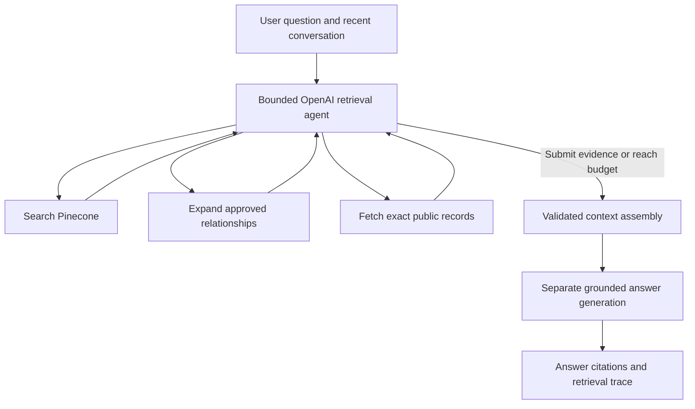

# Adaptive Portfolio RAG Architecture and Information Refresh

## Status

- **Document type:** Technical design proposal
- **Implementation status:** Design only
- **Primary systems:** Next.js portfolio, Flask AI service, OpenAI Responses API, Pinecone
- **Primary constraint:** Remain practical for a personal website, use the OpenAI data-sharing incentive where eligible, and stay within Pinecone Starter limits at expected traffic
- **Execution plan:** [End to End Implementation Plan for the Adaptive Portfolio RAG Agent](RAG_AGENT_E2E_IMPLEMENTATION_PLAN.md)

## Executive decision

Rebuild the portfolio assistant around a bounded LLM retrieval agent and a reviewed, structured knowledge corpus. Pinecone remains the vector database. OpenAI becomes the reasoning and answer provider.

The assistant will no longer turn the user's full message directly into one fixed `top_k=5` vector search. GPT-5.4 Mini will normally choose validated retrieval actions, inspect their results, and refine the investigation until the evidence is sufficient or a hard execution budget is reached. The Flask service, rather than OpenAI, executes semantic search, relationship expansion, and exact record fetching. A separate GPT-5.4 call will normally write the final answer from only the submitted evidence; GPT-5.4 Mini becomes the answer model when the regular-model daily allowance approaches its limit.

Relationships will be represented without adding a graph database. The reviewed source dataset will contain entities, claims, concepts, and evidence-backed relationships. Pinecone will contain searchable documents for all four. This supports questions such as "What is Sachin's agent experience?" even when the evidence spans Microsoft, Zipline, Nokia, InterfaceAI, LearnBridge, and other projects.

The information refresh and retrieval redesign should be delivered together because improved retrieval cannot correct stale, contradictory, private, or unsupported source material.

## Compatibility and cutover principle

Build the redesign beside the current application as **RAG v2**. The current implementation remains the active **RAG v1** until v2 has passed its complete acceptance suite and the final cutover is separately reviewed.

During development:

- Do not change the behavior of the existing `/ask` or `/vector-data` endpoints.
- Do not replace `ChatInterface.tsx` or `VectorVisualizer.tsx`; create v2 components and a non-linked preview route.
- Do not write to, reset, rename, or delete the active Pinecone index or namespace. V2 always uses a separate index, even if the embedding dimension matches.
- Do not repurpose existing environment variables. Use separate `RAG_V2_*`, `OPENAI_*`, and staged Pinecone configuration.
- Do not redirect production traffic, change the deployed backend URL, or deploy over the current service.

The v2 backend runs independently on a different local port and, later, in a separate staging service. It exposes versioned endpoints such as `/v2/ask`, `/v2/health`, and `/v2/ready`. The v2 frontend uses `/api/rag-v2/ask` from a hidden or owner-only preview page. V2 uses a dedicated Pinecone index and versioned namespace, so neither v2 ingestion nor the legacy v1 reset behavior can affect the other system. Existing visitors continue using v1 throughout development and staging.

Cutover is one small routing change after both systems have been tested side by side. The v1 backend, UI path, Pinecone target, configuration, and deployment remain available for immediate rollback. No v1 resource is removed until v2 has operated successfully for an agreed observation period and a later cleanup is approved.

## Goals

1. Answer narrow factual questions, broad profile questions, comparisons, follow-ups, and cross-cutting thematic questions.
2. Discover relevant connections as the corpus changes instead of depending on a fixed list of routing rules.
3. Keep every factual answer grounded in approved public evidence.
4. Distinguish personal contributions, team outcomes, prototypes, completed work, and plans.
5. Return useful source information with each answer.
6. Keep Pinecone as the database and remain suitable for its Starter plan.
7. Make information refreshes reviewable, versioned, and reversible.
8. Preserve the existing Next.js and Flask deployment boundary.
9. Keep the current production implementation working and independently reachable throughout v2 development, staging, and initial rollout.

## Non-goals

- Building an autonomous research agent that edits the public profile without review.
- Embedding every Google Doc, application draft, tutorial, or private note.
- Adding Neo4j or another graph database.
- Fine-tuning an embedding or language model.
- Running an unlimited number of retrieval loops.
- Treating generated relationships as facts without supporting claims.
- Replacing the portfolio's visual design as part of the RAG work.

## Current system and failure modes

The current backend reads `ai/sachin-info`, separates text at blank lines, embeds each resulting section with `sentence-transformers/all-MiniLM-L6-v2`, retrieves five matches, and passes them to a RetrievalQA chain. The API returns the answer but omits the source documents that the chain retrieved.

This design has six main weaknesses:

1. **Stale and inconsistent inputs.** The chatbot corpus and `app/data/portfolio-data.json` contain older descriptions that conflict with newer profile material.
2. **Uncontrolled chunking.** Blank-line boundaries do not consistently represent a complete claim or useful retrieval unit.
3. **One-vector query compression.** A compound question becomes one average representation, so one subject can dominate the results.
4. **Fixed result count.** Five results may be excessive for a date question and insufficient for a cross-experience synthesis.
5. **Duplicate crowding.** Similar chunks about one role can occupy most retrieval slots.
6. **No retrieval evidence in the response.** The UI cannot show which records supported the answer or whether coverage was weak.

Changing only the embedding model will not address these problems. The system needs better source information, better retrieval units, and adaptive tool use.

## Proposed architecture



The architecture contains four logical layers:

1. **Reviewed knowledge layer:** canonical public entities, claims, concepts, and relationships.
2. **Indexing layer:** document construction, embeddings, and versioned Pinecone upserts.
3. **Adaptive retrieval layer:** bounded structured actions, iterative search, relationship expansion, exact record fetching, and evidence submission.
4. **Answer layer:** grounded generation, citations, uncertainty, and a retrieval trace for the frontend.

## Knowledge model

### Canonical source

Create one reviewed JSON dataset in the repository as the source from which the public portfolio and the RAG index can be generated. Pinecone is a searchable projection of this source, not the only copy of the information.

The profile hub and source documents remain editorial inputs. They should not be runtime dependencies of the public website, and their full contents should not be automatically embedded.

### Entity records

An entity is a durable subject such as a role, project, organization, education record, skill area, or achievement.

```json
{
  "id": "microsoft-2026",
  "type": "experience",
  "name": "Microsoft Software Engineering Internship",
  "aliases": ["Microsoft", "PowerPoint Web", "PPT Web"],
  "start_date": "2026-05",
  "end_date": "2026-08",
  "status": "completed",
  "visibility": "public",
  "summary": "Reviewed public summary",
  "public_links": [],
  "source_revision": "2026-09-21"
}
```

### Claim records

A claim is the smallest factual statement that the assistant may repeat. It preserves attribution and qualifications better than a long biography paragraph.

```json
{
  "id": "claim-microsoft-browser-eval",
  "entity_id": "microsoft-2026",
  "claim_type": "contribution",
  "text": "Built a PR-aware browser-agent evaluation prototype comparing baseline and feature builds across varied environments.",
  "ownership": "personal-contribution",
  "maturity": "prototype",
  "evidence_status": "source-backed",
  "visibility": "public",
  "source_ids": ["career-profile-microsoft-case-study"],
  "valid_from": "2026-05",
  "valid_to": "2026-08"
}
```

### Dynamic concept records

Concepts represent themes that connect otherwise separate entities. Examples may include agent systems, evaluation infrastructure, simulation, retrieval, developer tools, ML infrastructure, or computer vision.

The concept list is not hardcoded into query routing. During each reviewed information refresh, the OpenAI extraction model receives the current concept registry and the new or changed approved-public claims. It may align claims with existing concepts, recommend merged concepts, or propose new concepts. The refresh preview shows these changes before indexing.

```json
{
  "id": "concept-agent-systems",
  "name": "Agent systems",
  "description": "Systems that plan, use tools, act in an environment, recover, or evaluate agent behavior.",
  "aliases": ["AI agents", "agentic systems", "autonomous workflows"],
  "status": "approved"
}
```

### Evidence-backed relationship records

A relationship connects entities, claims, or concepts. Every relationship references the claims that justify it.

```json
{
  "id": "relationship-microsoft-agent-evaluation",
  "from_id": "microsoft-2026",
  "to_id": "concept-agent-systems",
  "relation": "demonstrates",
  "explanation": "The work evaluated browser-agent behavior and produced reproduction evidence.",
  "supporting_claim_ids": ["claim-microsoft-browser-eval"],
  "confidence": "high",
  "visibility": "public"
}
```

This is a lightweight knowledge graph stored as ordinary JSON and searchable Pinecone records. It permits relationship expansion without adding graph infrastructure.

## Information refresh workflow

### Source precedence

Use the sources for different purposes:

1. **Profile hub:** organized editorial inventory and evidence status.
2. **Comprehensive career profile:** detailed explanations and claim reconciliation.
3. **Documents repository:** supporting records and historical context.
4. **Application tracker:** goals, draft answers, and application context; not proof that an outcome occurred.
5. **Current website data:** current public wording that must be replaced or preserved deliberately.

No source wins merely because it is newer. Claims are reconciled individually using dates, evidence quality, ownership, and scope.

### Refresh process

1. Export or read the selected source material in an offline refresh command.
2. Redact credentials and exclude private, employer-sensitive, historical-draft, and non-profile material before LLM processing.
3. Ask the OpenAI extraction model for structured proposed entities and atomic claims from the sanitized, approved-public source selection.
4. Compare proposed records with the current canonical dataset by stable ID.
5. Ask the OpenAI extraction model to update the dynamic concept registry and propose evidence-backed relationships.
6. Produce a review report containing additions, edits, conflicts, removals, and unresolved claims.
7. Approve the public records to be indexed. Unapproved records remain outside the public namespace.
8. Generate retrieval documents and content hashes.
9. Embed only new or changed documents.
10. Upsert them into a versioned namespace inside the separate v2 Pinecone index and verify record counts and sample retrievals.
11. Point only the v2 application at that staged index and namespace after the evaluation passes. V1 remains on its original target.

The refresh must be a command-line administrative operation. It must not remain an unauthenticated public `/reset_db` endpoint.

## Retrieval document design

Each entity produces several document types.

### Overview document

A short entity summary used for broad questions. It includes the name, role or project type, period, status, and most important contribution.

### Focused claim-group documents

Claims are grouped into coherent sections such as:

- contribution
- technical approach
- result
- responsibility and ownership
- maturity or limitation

Each group should normally contain 150–350 tokens. The entity name, role, period, and status are repeated in the document text so the passage remains meaningful when retrieved by itself.

### Concept documents

A concept document briefly explains a theme and lists its supported relationships. It acts as a navigational entry point for broad questions. It does not replace the underlying claim documents as evidence.

### Relationship documents

A relationship document explains why two items are connected and identifies the supporting claims. These documents help semantic retrieval discover less obvious correlations.

### Pinecone metadata

Every vector record should contain compact metadata:

```json
{
  "record_id": "microsoft-2026:technical:browser-eval:v3",
  "document_type": "claim_group",
  "entity_id": "microsoft-2026",
  "entity_type": "experience",
  "section": "technical_approach",
  "status": "prototype",
  "visibility": "public",
  "concept_ids": ["concept-agent-systems", "concept-evaluation"],
  "relationship_ids": ["relationship-microsoft-agent-evaluation"],
  "source_ids": ["career-profile-microsoft-case-study"],
  "content_hash": "...",
  "corpus_version": "2026-09-21"
}
```

Metadata controls eligibility and traceability. Semantic content needed for matching must still appear in the embedded text.

## Bounded LLM retrieval agent

### Agent responsibility

GPT-5.4 Mini receives the current question, a compact window of recent conversation, the allowed action schema, and the remaining execution budgets. It may return four action types:

1. `search_knowledge` for semantic Pinecone retrieval.
2. `expand_relationships` for one-hop traversal of approved evidence-backed connections.
3. `fetch_records` for full public context after a record is discovered.
4. `submit_evidence` to finish retrieval with selected record IDs, a resolved question, a coverage summary, and remaining gaps.

This lets the model adapt after seeing search results. It can discover that an agent-experience question spans browser automation, evaluation, recovery workflows, retrieval, and domain-tool interfaces without relying on a hardcoded semantic route.

### Execution loop

The model returns a JSON object that conforms to a strict schema. The service validates each requested action, executes it locally, returns a compact result to the model, and repeats until `submit_evidence` succeeds or a hard budget is reached. Independent search actions requested in one model turn may run concurrently.

The initial implementation deliberately does not use OpenAI hosted tools or function-calling requests. OpenAI's complimentary-token program excludes tool use. A structured action protocol preserves adaptive agent behavior while Pinecone calls remain ordinary backend operations. A small billing smoke test must confirm that this exact request shape is recorded under the `data sharing incentive tier` before production rollout.

The normal expectation is one to four searches. The hard ceiling is ten Pinecone searches, six agent turns, two relationship expansions, forty retained candidates, and ten submitted evidence records.

### Backend validation

Deterministic validation remains necessary even though retrieval decisions are LLM-driven. It is an execution boundary, not a rule-based understanding system.

The backend will:

- Clamp `top_k` to an approved range.
- Permit only known metadata fields and operators.
- Force `visibility=public` and the active corpus version.
- Limit query length and conversation history.
- Count duplicate and failed searches against the budget.
- Reject unknown record IDs and require submitted IDs to have appeared in action results.
- Apply timeouts and total search, tool, candidate, and token budgets.
- Fall back to the strongest observed candidates if the agent stops without a valid submission.

The LLM decides what evidence is needed and when the investigation is complete. Code ensures that the process is bounded, safe, and executable.

## Retrieval execution

### Semantic search

Each search action embeds its query independently and searches Pinecone. Separate searches prevent one aspect of a compound question from overwhelming the others.

### Candidate tracking

The backend deduplicates record IDs, retains which searches discovered each record, and keeps a bounded set of candidates. Raw similarity scores remain attached to their originating search rather than being treated as universally comparable.

### Relationship expansion

The agent may follow approved relationships from discovered records. Expansion is limited to one graph hop per call. Multi-hop traversal would increase noise and make correlations harder to justify.

### Evidence submission

The agent selects a compact, diverse evidence set and declares any remaining gap through `submit_evidence`. Separating retrieval from final prose generation makes weak coverage, excessive searching, and unsupported citations observable and testable.

## Answer generation

The answer model receives only the selected evidence, organized by entity and concept. It also receives:

- The original and resolved questions.
- Claim IDs and source labels.
- Dates, maturity, ownership, and evidence status.
- Any conflicts or gaps identified during the agent's evidence submission.

The response contract should include:

```json
{
  "answer": "...",
  "sources": [
    {
      "record_id": "microsoft-2026:technical:browser-eval:v3",
      "label": "Microsoft browser-agent evaluation",
      "url": null
    }
  ],
  "coverage": "complete",
  "limitations": []
}
```

The assistant must not infer that a prototype was deployed, combine metrics from different scopes, or expose private evidence references. When evidence is incomplete, it should describe what is known and state the missing part briefly.

## Embedding strategy

### Initial implementation

Keep the current embedding model during the first retrieval-agent implementation. This isolates the benefit of better documents, iterative search, relationships, and evidence selection.

Re-embed the refreshed corpus with properly bounded child documents so the current model does not silently lose important content through long inputs.

### Model evaluation

After the new pipeline has a working evaluation suite, compare:

1. Current `all-MiniLM-L6-v2` at 384 dimensions.
2. Pinecone `llama-text-embed-v2`, preferably at a supported reduced dimension if quality is sufficient.
3. OpenAI `text-embedding-3-small` only as an optional paid benchmark.

Choose using retrieval coverage on this corpus, latency, operational simplicity, and cost. Do not choose from a general leaderboard alone.

Pinecone Starter currently includes a monthly embedding-token allowance for `llama-text-embed-v2`, which makes it an attractive later candidate. OpenAI embedding models are not listed in the complimentary prompt/completion offer, so they are not the default. A model change requires re-embedding every record. Vectors from different models must never share a searchable namespace even when their dimensions match.

## Reranking and hybrid retrieval

Do not require a hosted reranker in the initial version. The retrieval agent already evaluates candidates in the context of the question, while Pinecone Starter's included hosted reranking requests are limited.

Add a reranker only if the evaluation shows that the candidate set usually contains the correct evidence but orders it poorly. Pinecone supports two-stage retrieval and hosted reranking.

Likewise, defer sparse or hybrid retrieval until tests demonstrate recurring misses for exact names or technical identifiers. LLM-generated search variants, descriptive titles, aliases in document text, and concept records should cover many of these cases first.

## Conversation handling

The frontend will send a bounded recent history with each question. The retrieval agent will resolve references such as "there," "that project," or "how did it compare?" before selecting evidence.

Conversation history is used for interpretation, not stored as profile knowledge and not written to Pinecone. The final answer remains grounded in the approved corpus.

## API design

### Request

`POST /v2/ask` during development and staging. The public same-origin proxy routes to it only after cutover.

```json
{
  "question": "How does that connect to your other agent work?",
  "history": [
    {"role": "user", "content": "Tell me about InterfaceAI."},
    {"role": "assistant", "content": "..."}
  ],
  "debug": false
}
```

### Response

```json
{
  "status": "success",
  "answer": "...",
  "sources": [],
  "retrieval": {
    "resolved_question": "...",
    "concepts": ["Agent systems"],
    "selected_record_ids": [],
    "visualization": {
      "method": "pca-2d",
      "corpus_version": "profile-v3",
      "queries": [
        {
          "id": "query-1",
          "text": "Sachin agent systems experience",
          "purpose": "Find the main experiences",
          "x": 0.18,
          "y": -0.42,
          "candidate_ids": []
        }
      ],
      "points": []
    }
  }
}
```

Production responses should omit internal prompts and full private metadata. A development-only trace may include planned searches, candidate ranks, selected evidence, latency, and token use.

The vector visualization should consume the same retrieval trace used to generate the answer. It should display candidate and selected evidence, rather than launching an unrelated second search.

## RAG embedding-space visualization

Keep the existing **RAG Embedding Space Visualization** as a first-class feature. Replace its current independent retrieval and per-request PCA fit with a versioned projection tied to the active corpus.

During corpus generation:

1. Fit one two-component PCA transform across all approved public corpus embeddings.
2. Save the PCA mean, two components, explained-variance values, embedding model, dimension, and corpus version in a generated projection artifact.
3. Save one stable two-dimensional point for each public retrieval record.
4. Rebuild the artifact whenever the corpus or embedding model changes.

During a question, apply that saved transform to every semantic search-query embedding. All query points and corpus records then share one coordinate system. Do not refit PCA when a visitor checks or unchecks a query; otherwise the map would move and comparisons would be misleading.

The default view shows the first, primary semantic query on top of the complete public corpus map. When the agent performs additional searches, the interface adds a checkbox for each query. Visitors may select any combination or choose **Show all**. Selected queries receive distinct accessible colors, query markers, and translucent envelopes around the records actually returned for that query. The envelopes visualize retrieved sets, not distance thresholds.

A record appears only once in the base map. Query-specific highlights are overlaid at its fixed position. A record retrieved by several selected queries receives concentric colored outlines, making overlap visible. Evidence used in the final answer receives an additional high-contrast marker. Hover or focus details show:

- Record title, entity, and concept.
- Which selected queries retrieved it.
- Original-space cosine score and rank for each query.
- Whether it was used as final evidence or reached through a relationship.

The visualization must state that PCA is an illustrative two-dimensional projection. Actual retrieval rank comes from similarity in the full embedding space. Remove the artificial fixed-radius search circle and the "closest in 2D" calculation because neither represents Pinecone's real retrieval decision.

The `/ask` response returns compact two-dimensional coordinates, query-to-record memberships, ranks, and similarity scores. It does not send raw embeddings to the browser. For the expected corpus size of hundreds of points, the complete background map can travel with the first response and be cached by corpus version. No extra Pinecone query or OpenAI call is needed to draw or toggle the visualization.

## Technology decisions

| Responsibility | Technology | Decision |
|---|---|---|
| Portfolio UI | Next.js 14 and React | Keep |
| Public API proxy | Next.js route handlers | Keep for server-side backend URL handling |
| AI service | Separate Flask/Gunicorn v2 entry point during development and staging | Add beside v1 |
| Retrieval agent | OpenAI Responses API with strict structured-action output | Add to the Flask service |
| Tool validation | Pydantic or equivalent schema validation | Add explicitly if imported directly |
| Vector database | Pinecone serverless in `us-east-1` | Keep |
| Initial embeddings | Existing Hugging Face MiniLM endpoint | Keep for the first evaluation |
| Candidate fusion | Small local Python module implementing reciprocal-rank fusion | Add without an external service |
| Relationship store | Canonical JSON plus Pinecone records and metadata | Add; no graph database |
| Evidence selection | Retrieval agent `submit_evidence` action | Add, within the shared search budget |
| Answer generation | `gpt-5.4-2026-03-05`, with `gpt-5.4-mini-2026-03-17` fallback | Add with a structured response contract |
| PCA projection | Versioned generated transform and two-dimensional record map | Rebuild with each corpus version |
| Visualization | New v2 Plotly component with query checkboxes and shared overlays | Build beside the existing component |
| Orchestration | Explicit Python service functions | Prefer over a large agent framework |
| Evaluation | Versioned JSON question set plus Python test runner | Add |
| Observability | Structured logs with request ID, timings, query count, selected IDs, and errors | Add |

Use the official OpenAI Python SDK directly for the Responses API. LangChain may remain temporarily for an existing embedding or Pinecone adapter, but it should not own the retrieval loop. The explicit application loop keeps search execution, relationship expansion, evidence submission, model routing, and evaluation independently testable.

No additional database, queue, cache, graph engine, or frontend state library is required for the initial implementation. V2 isolation is achieved through separate modules, routes, configuration, deployment, Pinecone index, and namespace rather than by rewriting v1 in place.

## OpenAI model and complimentary-token policy

Use a dedicated OpenAI project for the public portfolio. Input/output sharing must be enabled for that exact project, and the application must use a project-scoped API key from it. The account must retain a positive balance because complimentary tokens do not make the API account a free tier.

Pin the eligible snapshots rather than relying on moving aliases:

- **Retrieval planning and structured extraction:** `gpt-5.4-mini-2026-03-17`.
- **Final answer while the regular-model budget is available:** `gpt-5.4-2026-03-05`.
- **Final-answer fallback:** `gpt-5.4-mini-2026-03-17`.

For usage tiers 1–2, the current offer provides 250,000 daily tokens across the regular-model group and 2.5 million daily tokens across the mini/nano group. These are separate shared group quotas and reset at 00:00 UTC. A request that crosses the remaining allowance is billed in full, so the application must switch early rather than wait for an exact 250,000-token boundary.

Default application thresholds:

- Switch final-answer generation from GPT-5.4 to GPT-5.4 Mini at 220,000 observed regular-group tokens in the current UTC day.
- Stop or return a clear daily-cap message at 2.3 million observed mini-group tokens unless `OPENAI_ALLOW_PAID_OVERAGE=true`.
- Cap response size and count both input and output usage returned by every completed response.
- Reset the local counters at 00:00 UTC.

The backend will maintain a lightweight daily ledger and log the exact model snapshot, input tokens, output tokens, and selected route. A process-local ledger is enough for initial single-instance deployment, but it can reset after a restart. Therefore it is an optimization rather than a billing guarantee. A project hard spend limit in the OpenAI dashboard is the final protection against unexpected paid overage. The application will not receive an organization Admin API key merely to query the Usage API.

Before relying on the offer, run small requests for both snapshots and verify two views in the OpenAI Usage Dashboard: token activity grouped under `data sharing incentive tier`, and no corresponding cost. Repeat this verification for the structured-action request shape. If it is not counted as complimentary traffic, pause the adaptive loop and keep the refreshed single-query Pinecone baseline until the plan is revised.

Only approved public profile content and public visitor questions may be sent through the sharing-enabled project. Raw private notes, employer-confidential material, credentials, and unapproved source documents must remain local or use a separate non-sharing project.

## Pinecone Starter budget

The current Pinecone Starter plan advertises up to 2 GB of database storage, 1 million monthly read units, 2 million monthly write units, five indexes, and 100 namespaces per index. The planned corpus should contain hundreds rather than tens of thousands of records, so storage is not a practical constraint.

Adaptive retrieval increases reads because one user question may create several searches. Control usage through:

- Maximum four initial searches.
- A ten-search hard limit with one to four searches expected normally.
- Small `top_k` values per search.
- Parallel execution to reduce wall-clock latency.
- No search during the answer-generation stage.
- Usage logging and monthly budget alerts.
- Retaining only the required v2 corpus namespaces while leaving the protected v1 index outside the v2 lifecycle.

Inference quotas are separate from database limits. Hosted reranking should remain optional, and model pricing and plan limits must be checked again immediately before implementation or deployment.

## Security and reliability

1. Expose no destructive index reset behavior in v2. Leave v1 unchanged during parallel development, then retire its reset route only through the later cleanup approval.
2. Never create or delete indexes in the normal question path.
3. Enforce `visibility=public` in backend code regardless of the LLM plan.
4. Treat retrieved text as evidence, not executable instructions.
5. Store credentials only in environment variables and never in the canonical dataset or vector metadata.
6. Redact secrets and remove private or employer-sensitive content before any source material reaches the sharing-enabled OpenAI project.
7. Use stable IDs and content hashes for idempotent updates.
8. Preserve the previous namespace until the new one passes evaluation.
9. Apply request-size, history-size, query-count, timeout, and rate limits.
10. Return a clear insufficient-evidence response when retrieval or model calls fail.
11. Tell visitors briefly that chat inputs are sent through a sharing-enabled OpenAI project and should not contain sensitive information.

## Evaluation plan

Create a versioned set of 40–60 representative questions divided across:

- Direct facts.
- Single-role deep questions.
- Broad profile summaries.
- Cross-cutting themes such as agent systems or ML infrastructure.
- Multi-entity comparisons.
- Conversational follow-ups.
- Temporal and status-sensitive questions.
- Unsupported, fictional, private, or employer-sensitive requests.

Each case should define:

- Expected entities or claims.
- Required qualifications.
- Forbidden claims.
- Whether complete coverage requires multiple experiences.
- Expected behavior when evidence is absent.

Measure:

- Candidate recall: whether the needed claims appeared before evidence selection.
- Selected-evidence coverage: whether all material parts of the question are represented.
- Citation correctness.
- Answer faithfulness.
- Correct handling of ownership, status, and dates.
- Planner query count.
- Pinecone usage, model tokens, latency, and errors.

Compare the current system, the refreshed single-query baseline, and the adaptive agent. This reveals how much improvement comes from content, indexing, and iterative tool use separately.

## Implementation plan

### Phase 0 Protected v1 baseline

- Record the current source diff, endpoint contracts, environment names, deployed URLs, Pinecone target, API responses, and browser behavior.
- Identify `ai/rag.py`, current API paths, current chat and visualization components, v1 configuration, and the active Pinecone target as protected.
- Build v2 only in separate modules, routes, components, configuration, and staged data resources.
- Run v1 and v2 side by side and rerun the v1 smoke suite after every integration milestone.

**Exit condition:** V1 is independently reproducible and remains the public path; v2 can fail or stop without affecting it.

### Phase 1 Information reconciliation

- Build the canonical public dataset.
- Add Microsoft and Zipline.
- Correct Shopify, graduation date, project status, ownership, and metric scope.
- Reconcile the chatbot corpus with the visible portfolio data.
- Mark unresolved claims for review instead of indexing them as facts.

**Exit condition:** The reviewed canonical dataset can generate both the public portfolio fields and the RAG documents without known contradictions in critical facts.

### Phase 2 Versioned ingestion

- Implement entity, claim, concept, and relationship schemas.
- Add LLM-assisted extraction and relationship proposals.
- Produce a human-readable refresh diff.
- Build deterministic document construction and content hashing.
- Stage updates in a versioned namespace inside the dedicated v2 Pinecone index.
- Give v2 an offline administrative refresh command and no public mutation endpoint. Defer any v1 endpoint cleanup until after cutover and observation.

**Exit condition:** A separate v2 index and staged namespace can be built, inspected, and discarded without modifying the active v1 corpus.

### Phase 3 Adaptive retrieval

- Add the bounded OpenAI structured-action loop.
- Implement and validate the search, relationship, exact-fetch, and evidence-submission actions.
- Allow concurrent execution for independent searches requested in one agent turn.
- Enforce search, turn, expansion, candidate, and timeout budgets.
- Generate answers from selected evidence with the GPT-5.4-to-Mini budget route.

**Exit condition:** The adaptive pipeline outperforms the refreshed single-query baseline on thematic, comparison, and follow-up questions without regressing direct facts.

### Phase 4 API and frontend evidence

- Send bounded conversation history.
- Return sources and coverage information.
- Generate one stable PCA artifact for the active corpus.
- Return every semantic query, its real candidates, ranks, scores, and projected coordinates in the answer's retrieval trace.
- Default the visualization to the primary query and add checkbox overlays for additional queries.
- Keep corpus points fixed while filters change and visually identify cross-query overlap and final evidence.
- Add clear insufficient-evidence and provider-failure states.

**Exit condition:** A visitor can compare one or several searches on a stable two-dimensional corpus map, see which portfolio records supported the answer, and confirm that the visualization matches the exact evidence used by the chatbot.

### Phase 5 Embedding and optional retrieval experiments

- Benchmark the current MiniLM and Pinecone embedding candidates against the same evaluation set; include OpenAI embeddings only as an explicitly paid comparison.
- Test hosted reranking only if ordering remains a measured problem.
- Test hybrid retrieval only if exact-name misses remain a measured problem.
- Migrate only when the improvement justifies the operational change.

**Exit condition:** Any model or retrieval addition has a measured benefit and a documented Starter-plan cost.

## Acceptance criteria

The redesign is ready for deployment when:

1. Critical profile facts have no known contradictions between the website and chatbot corpus.
2. Every public answer can identify its supporting records.
3. Multi-part evaluation questions retrieve evidence for each requested part.
4. The agent-experience evaluation includes relevant evidence across multiple roles and projects without requiring a hardcoded agent route.
5. Follow-up questions resolve against bounded conversation history.
6. Unsupported and private claims are not exposed.
7. The original v1 deployment, configuration, and Pinecone index remain available for rollback through cutover and observation.
8. Production build, Python compile and dependency checks, API tests, and browser smoke tests pass.
9. Measured Pinecone and model usage remain within the approved operating budget.
10. The exact production request shape appears under OpenAI's data-sharing incentive tier, and the project has a hard spend limit.
11. The PCA map uses the active corpus version, exposes every semantic search from the answer run, and does not launch a second retrieval.
12. V1 remains functional and unchanged until the approved cutover, and rollback to its preserved deployment and Pinecone target is tested.

## Decisions deferred until implementation

- Final embedding model and dimension, pending corpus-specific evaluation.
- Whether a future separate reranker or evidence judge adds measurable value beyond the retrieval agent.
- Whether reranking or hybrid retrieval provides enough measured benefit to include.
- Exact v1 cleanup date after the minimum seven-day successful observation period.
- Whether the canonical public dataset replaces `portfolio-data.json` directly or generates it as a build artifact.

## Reference documentation

- [OpenAI data sharing and complimentary tokens](https://help.openai.com/en/articles/10306912-sharing-feedback-evaluation-and-fine-tuning-data-and-api-inputs-and-outputs-with-openai)
- [GPT-5.4 model and snapshot](https://developers.openai.com/api/docs/models/gpt-5.4)
- [GPT-5.4 Mini model and snapshot](https://developers.openai.com/api/docs/models/gpt-5.4-mini)
- [OpenAI Responses API](https://developers.openai.com/api/reference/python/resources/responses/methods/create)
- [OpenAI model selection](https://developers.openai.com/api/docs/guides/model-selection)
- [OpenAI organization usage API](https://developers.openai.com/api/reference/python/resources/admin/subresources/organization/subresources/usage/methods/completions)
- [OpenAI project and spend-limit management](https://help.openai.com/en/articles/9186755)
- [Pinecone metadata filtering](https://docs.pinecone.io/guides/search/filter-by-metadata)
- [Pinecone reranking](https://docs.pinecone.io/guides/search/rerank-results)
- [Pinecone hybrid search](https://docs.pinecone.io/guides/search/hybrid-search)
- [Pinecone pricing and Starter limits](https://www.pinecone.io/pricing/)
